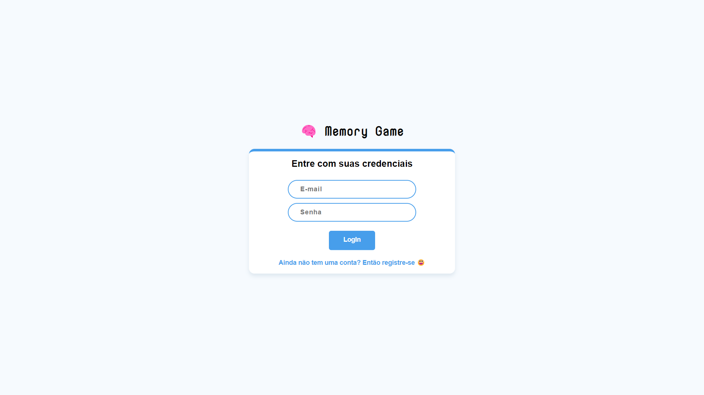
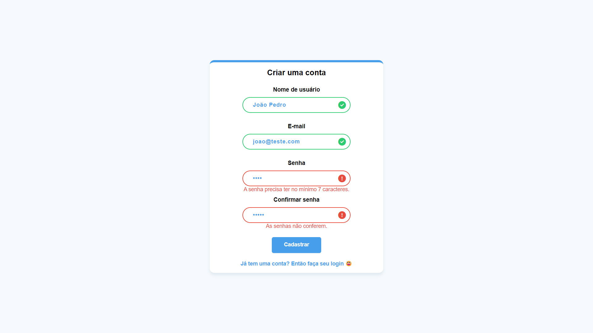
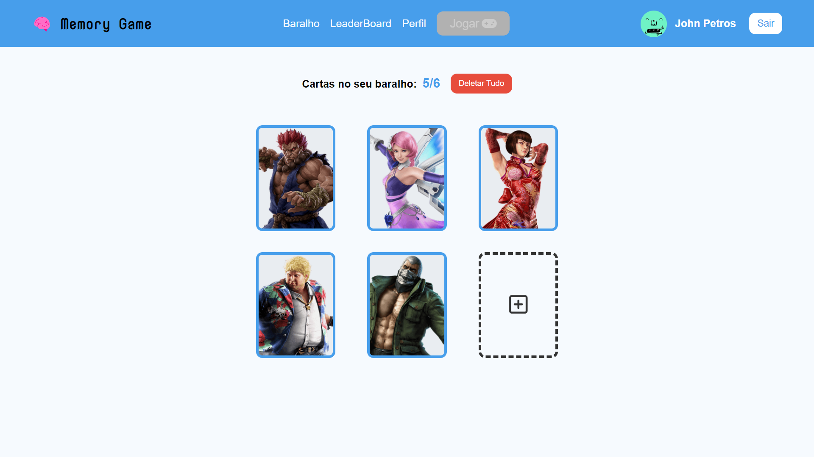
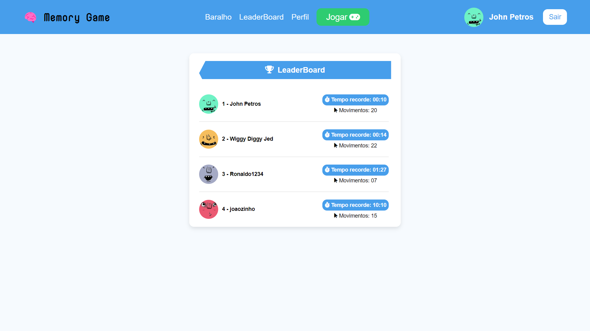
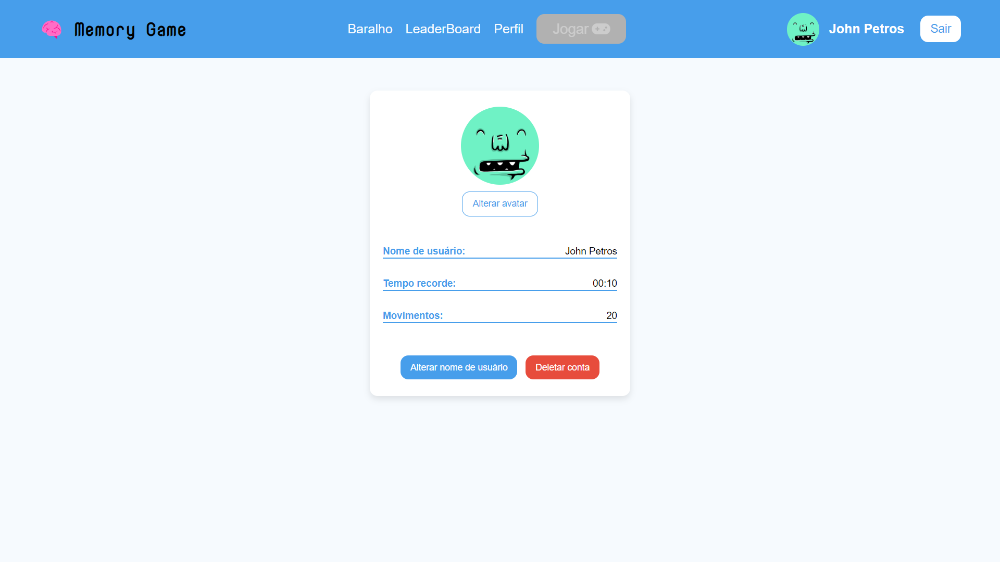
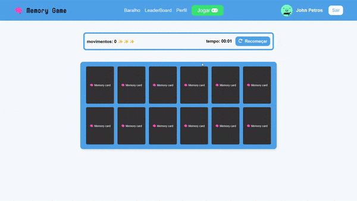

<h1 align="center">
   🧠 Memory Game
</h1>

<div align="center">
   <a href="https://github.com/JohnPetros">
      
   </a>
   
   <a href="https://github.com/JohnPetros/memory-game/commits/main">
      
   </a>
  </a>
   </a>
   <a href="https://github.com/JohnPetros/memory-game/blob/main/LICENSE.md">
      
   </a>
    
</div>

<br>

## 💻 Projeto

Projeto web de **jogo da memória** em PHP com sistema de usuários e de personalização do próprio baralho do jogo. Originalmente, esse projeto foi desenvolvido como dever de casa para a disciplina de programação web na Etec com o intuito de praticar o upload e gravação de imagens externas em um banco de dados com PHP, contudo, tomei a liberdade de acrescentar diversas outras funcionalidades, transformando-o em um jogo da memória customizado.

---

## ✅ Demonstração
<table align="center">
  <tr>
    <td align="center" width="750">
      <span>Tela de login</span>
    
    </td>
  </tr>
  <tr>
    <td align="center" width="750">
      <span>Tela de cadastro</span>
        
    </td>
  </tr>
  <tr>
    <td align="center" width="750">
      <span>Tela de configuração do baralho</span>
      
    </td>
  </tr>
  <tr>
    <td align="center" width="750">
      <span>Tela de ranking de usuários</span>
      
    </td>
  </tr>
  <tr>
    <td align="center" width="750">
      <span>Tela de perfil</span>
      
    </td>
  </tr>
  <tr>
    <td align="center" width="750">
      <span>Tela do jogo da memória funcionando</span>
      
    </td>
  </tr>
</table>

---

## ✨ Funcionalidades

- Cadastro e login de usuários
- Adição e deleção de cartas no baralho do usuário, tendo que conter precisamente 6 cartas para começar o jogo
- Jogo da memória com as cartas do baralho do usuário, que funciona da seguinte forma: todas as cartas começam viradas para baixo, ao desvirar uma carta, o jogador pode virar outra, caso sejam a mesma, ambas ficam desabilitadas, caso contrário as duas são viradas novamente para baixo. O usuário ganha o jogo caso todas as cartas ficam desabilitadas 
- O usuário pode reiniciar o jogo sempre que quiser
- Contagem em tempo real tanto dos movimentos de virada de cartas, quanto do tempo percorrido durante o jogo
- Sistema de ranking de usuários com base no recorde de tempo que cada um completou o jogo
- O usuário pode alterar seus dados (nome de usuário e avatar)
- Sistema de validação em todos os formulários da aplicação
- mecanismo de toast message que dá feedback pra cada ação de sucesso ou de erro do usuário
- Layout responsivo

---

## 📖 Aprendizado

- Sistema de login e cadastro com PHP
- Upload de arquivos em PHP, bem como a manipulção desses arquivos dentro do sistema
- Como criar relacionamento entre tabelas com PHPMyAdmin
- Como descobrir a ocorrência de uma determinada string em um deternimando texto com função strpos do PHP
- Como permitir a entrada de múltiplos dados de um único input 
- Validação de formulário com JS
- Como criar a lógica de um jogo de memória usando JS
- Novas formas de trabalhar com eventos em JS através do prototype de objetos
- Como embaralhar elementos dentro de um array JS de forma simples com o método [sort](https://developer.mozilla.org/pt-BR/docs/Web/JavaScript/Reference/Global_Objects/Array/sort)
- Como manipular o location do cabeçalho da página com JS por meio do objeto window
- Como manipular o conteúdo de um modal de forma dinâmica com JS
- Animações simples e efeito de filtro com CSS

---

## 🚀 Tecnologias

Esse projeto foi desenvolvido com as seguintes tecnologias

#### **Back-end**

- **[PHP](https://www.php.net/)**
- **[MySQL](https://www.mysql.com)**
- **[PHPMyAdmin](https://www.phpmyadmin.net/docs/)**

#### **Front-end**

- **[JavaScript](https://developer.mozilla.org/pt-BR/docs/Web/JavaScript)**
- **[CSS](https://developer.mozilla.org/pt-BR/docs/Web/CSS)**
- **[HTML](https://developer.mozilla.org/pt-BR/docs/Web/HTML)**
- **[FontAwesome](https://fontawesome.com/)**

---

## ⚙️ Deploy

O deploy desse projeto foi realizado através da [InfinityFree](https://www.infinityfree.net/), que é uma plataforma que a hospedagem gratuita de aplicações web junto com banco de dados

## 🛠️ Como executar o projeto

### Pré-requesitos

Antes de baixar o projeto você vai precisar ter instalado na sua máquina as seguintes ferramentas:

- Tenha acesso ao banco de dados [MySQL](https://www.mysql.com/downloads/)
- Tenha o PHP instalado pelo menos na [versão 7.4](https://prototype.php.net/versions/7.4/install/)

Além disto é bom ter um editor para trabalhar com o código como [VSCode](https://code.visualstudio.com/)

#### 📟 Rodando a aplicação
   > Caso tenha alguma dúvida confira este [guia de como contribuir no GitHub](./CONTRIBUTING.md)

```bash
# Clone este repositório
$ git clone  https://github.com/JohnPetros/memory-game.git

# Acesse a pasta do projeto no terminal/cmd
$ cd memory-game

# Vá para a pasta db
$ cd /src/db

# Procure o arquivos sql na pasta db para importá-los no MySQL

# Procure o arquivo config.php na pasta db e configure as variáveis de conexão do bando de dados
$dbhost = "host do banco de dados"
$dbuser = "nome de usuário do banco de dados"
$dbpassword = "senha do banco de dados"
$dbname = "nome do banco de dados"

# Execute a aplicação em um servidor local
```

## 💪 Como contribuir

1. Faça um **fork** do projeto.
2. Crie uma nova branch com as suas alterações: `git checkout -b my-feature`
3. Salve as alterações e crie uma mensagem de commit contando o que você fez: `git commit -m "feature: My new feature"`
4. Envie as suas alterações: `git push origin my-feature`
<br>

   > Caso tenha alguma dúvida confira este [guia de como contribuir no GitHub](./CONTRIBUTING.md)

---

## 📩 Contato

Entre em contato comigo por e-mail ou pelo meu LinkedIn:

<a href="mailto:joaopcarvalho.cds@gmail.com"></a>
<a href="https://www.linkedin.com/in/jo%C3%A3o-pedro-carvalho-dos-santos-42a0ab222/"></a>

---

## :memo: Licença

Esse projeto está sob a licença MIT. Veja o arquivo [LICENSE](LICENSE) para mais detalhes.

---

Feito com 💜 by João Pedro 👋🏻
